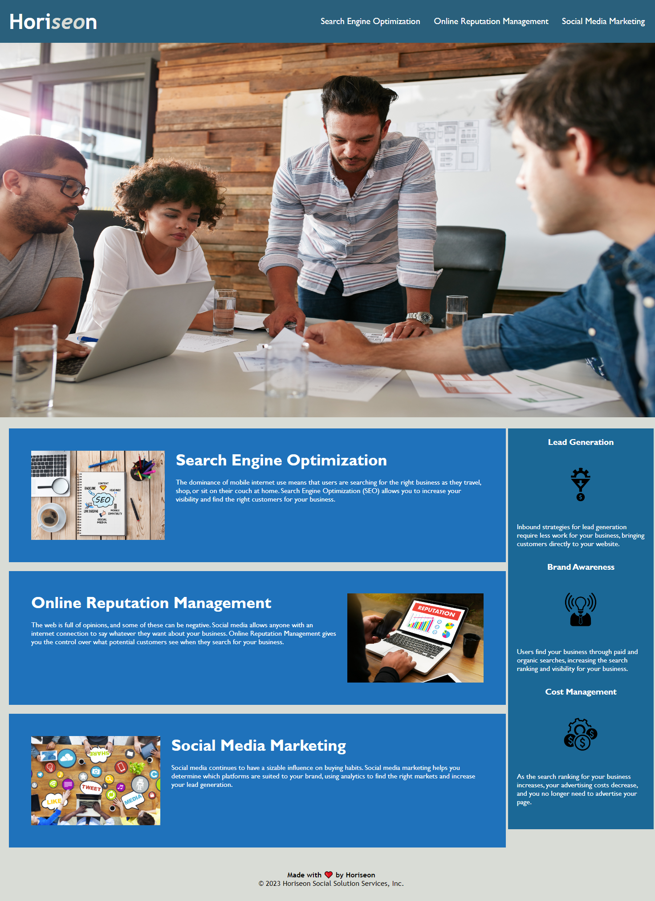

# 01 First Challenge --UCSD Coding Bootcamp

## Goal of the Project

As a marketing agency, Horiseon wants a codebase that follows standards of
accessibility so that its site is optimized for search engines.

### Changes Made to Previous Code 

HTML elements have been changed, wherever possible, to semantic elements
that you will hopefully find have a logical structure independent of styling
and positioning.  Corresponding changes have been made in the linked CSS 
file too.  To improve accessibility, icon and image elements now have alt
attributes.  Heading attributes fall in sequential order, and now we have a 
concise title (Horiseon).  The functionality of the page is not changed, but the 
appearance has been changed.

### Layout

This layout is designed for desktop viewing but can be adjusted for smaller 
screens if needed.

## Screenshot

## GitHub Link

https://github.com/GSuhir/First-Challenge.git

https://gsuhir.github.io/First-Challenge/

